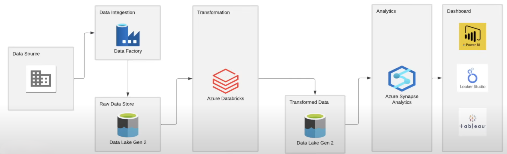
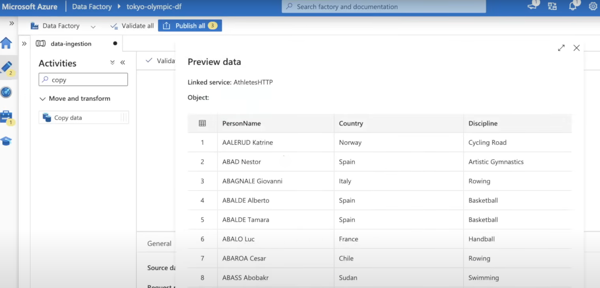
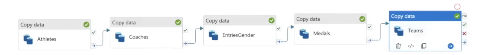
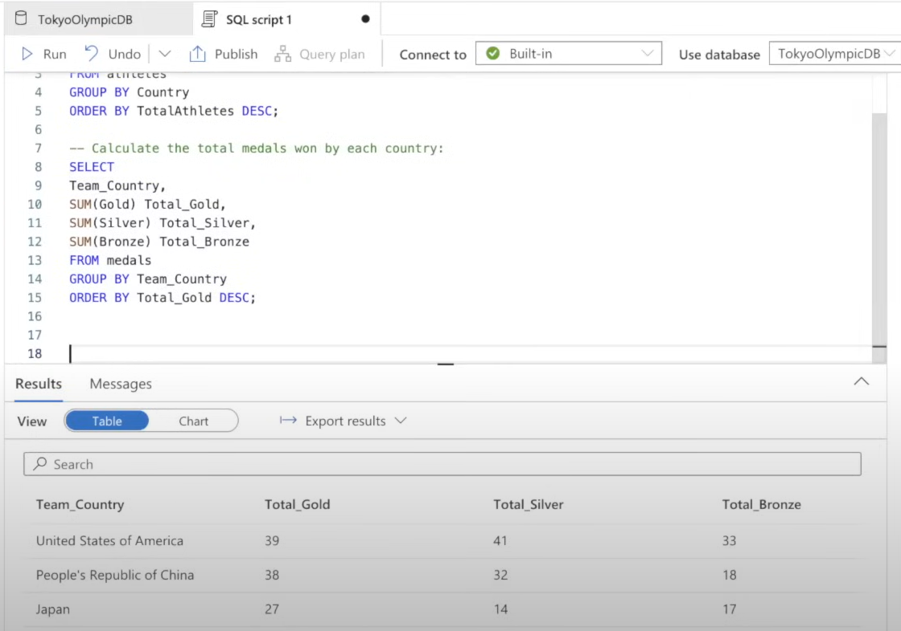

# Tokyo Olympics 2021 Data Engineering using Azure Data Services

## 🔍 Project Overview

This project demonstrates a complete end-to-end **data engineering and visualization pipeline** using **Azure Data Services** on the **Tokyo Olympics 2021 dataset**. It showcases how to fetch data from an API, ingest it using Azure Data Factory, store it in Azure Data Lake Storage, transform it using Databricks (Apache Spark), query it using Synapse Analytics, and finally visualize key insights in Power BI.

🔗 **Dataset Source**: [Kaggle – 2021 Olympics in Tokyo](https://www.kaggle.com/datasets/arjunprasadsarkhel/2021-olympics-in-tokyo)  
📓 **Notebook**: [Tokyo_Olympics_Analysis.ipynb](Tokyo Olympics Data Transformation.ipynb)

---

## 🧰 Azure Services Used

- **Azure Data Factory**: ETL and orchestration of data pipelines.
- **Azure Data Lake Storage Gen2**: Scalable storage for raw and transformed data.
- **Azure Databricks**: Data processing and transformation using Apache Spark.
- **Azure Synapse Analytics**: SQL-based data querying and analytics.
- **Power BI**: Visualizing KPIs and trends from Olympic datasets.

---

## 🛠️ Implementation Breakdown

### 1️⃣ Data Ingestion (Azure Data Factory)
- Raw dataset (CSV files) sourced using HTTP (API-like behavior).
- Created linked services and used **Copy Data** activity to ingest data into **Data Lake Storage** containers.
- Stored in organized folders: `raw` and `transformed`.

  

---

### 2️⃣ Data Transformation (Azure Databricks)
- Connected Databricks to Azure Data Lake using Service Principal & Key Vault.
- Mounted blob storage and wrote **Spark code** to clean, filter, and transform datasets.
- Saved the output in `transformed` folder in Data Lake.
- Tables processed: `athletes`, `coaches`, `entries_gender`, `medals`, `teams`.

---

### 3️⃣ Data Querying (Azure Synapse Analytics)
- Created a **Spark Pool** and loaded the transformed data.
- Used **SQL queries** to derive insights like medal tallies, gender participation, and team-wise performance.

---

### 4️⃣ Visualization (Power BI)
- Created interactive Power BI dashboards.
- KPIs included:
  - Total athletes & medals by country
  - Gender distribution
  - Medal types by sport
  - Athlete performance trends

---

